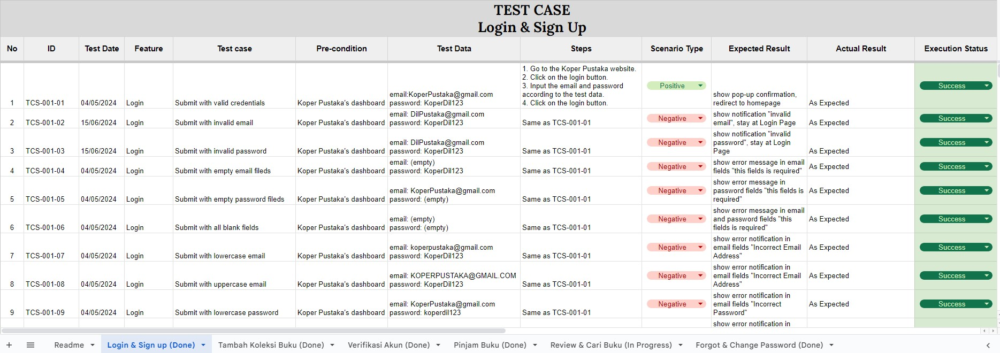

# Koper Pustaka 
Project Capstone K2-02 FAR

[Sekilas Tentang](#sekilas-tentang) | [Cara Pemakaian](#cara-pemakaian) | [Software Architecture](#software-architecture) | [Software Development](#software-development) |   [QA Test](#qa-test) | [Developers](#developers)  | [Referensi](#referensi)
:---:|:---:|:---:|:---:|:---:|:---:|:---:|

## Sekilas Tentang  
[`^ Back to Top ^`](#koper-pustaka)

### Apa Itu Koper Pustaka?
Koper Pustaka merupakan implementasi dari penelitian yang dikembangkan oleh Putrianti (2021) dan Okviani (2023), yang meneliti tentang perancangan pengalaman peminjaman buku secara lepas dan berantai pada aplikasi ini.

Koper Pustaka adalah Web Application yang mempermudah proses peminjaman dan pengembalian buku dengan menggunakan modul peminjaman berantai dan non-full berantai. Alur peminjaman di aplikasi ini diterapkan secara personal dan berantai dari satu individu ke individu lain tanpa kembali ke pemilik awal. Namun, jika sudah tidak ada yang meminjam, pemilik asli boleh mengambilnya kembali dan menunggu peminjam selanjutnya.

### Tujuan Koper Pustaka
1. Meningkatkan literasi masyarakat Indonesia melalui jalur pinjam-meminjam buku
2. Menyediakan layanan peminjaman buku yang mudah diakses bagi pengguna, sehingga memperluas aksesibilitas terhadap literasi dan pengetahuan
3. Memfasilitasi transaksi pinjam-meminjamkan buku antarindividu

## Cara Pemakaian
[`^ Back to Top ^`](#koper-pustaka)

1. **Pemilik Buku Mengunggah Buku**: Pemilik mengunggah informasi buku (judul, pengarang, genre, waktu pinjam, deskripsi) ke aplikasi.
2. **Buku Dipinjam oleh Peminjam 1**: Pengguna lain (Peminjam 1) melihat daftar dan meminjam buku yang diinginkan.
3. **Buku Diaktifkan Kembali oleh Peminjam 1**: Setelah selesai, Peminjam 1 mengaktifkan kembali status buku di aplikasi, membuatnya tersedia lagi.
4. **Buku Dipinjam oleh Peminjam 2**: Pengguna lain (Peminjam 2) meminjam buku yang telah diaktifkan kembali.
5. **Buku Kembali Diaktifkan**: Setelah selesai, Peminjam 2 mengulangi proses pengaktifan buku, membuatnya tersedia lagi

### Software Development
[`^ Back to Top ^`](#koper-pustaka)  

Software Development Terminology yang digunakan pada aplikasi Koper Pustaka adalah **Scrum**, yang merupakan kerangka kerja pengembangan perangkat lunak iteratif dan inkremental untuk mengelola proyek secara efisien.

### Programming Language

- **JavaScript (React.js)** -> Kerangka kerja JavaScript yang digunakan untuk pengembangan antarmuka pengguna aplikasi serta mengelola logika aplikasi dan alur data.
- **HTML** -> Membuat struktur dan konten dari halaman web aplikasi koper pustaka
- **CSS** -> Mendesain tampilan dan tata letak halaman web aplikasi koper pustaka

### Tools
 
- Figma ->  untuk merancang dan mendesain ulang antarmuka pengguna (UI) dan pengalaman pengguna (UX) aplikasi.
- Firebase -> untuk autentikasi, basis data real-time, penyimpanan, dan hosting aplikasi.
- Draw.io -> untuk membuat use case, class diagram, dan perencanaan sistem lainnya.
- Google Spreadsheet -> untuk pencatatan hasil test case.
- Selenium -> untuk pengujian otomatis aplikasi web untuk memastikan kualitas dan fungsionalitas aplikasi.
- Git dan Github -> untuk mengelola kode sumber aplikasi Koper Pustaka.

---
## Software Architecture
[`^ Back to Top ^`](#koper-pustaka)

### Use Case Diagram

### Class Diagram

### User Story

### Swimlane Diagram

---

## QA Test
[`^ Back to Top ^`](#koper-pustaka) 

Telah dilakukan pengujian dengan 50+ test case positif dan negatif  
Akses test case koper pustaka: [Link Test Cases ](https://docs.google.com/spreadsheets/d/1Es9WJ3QGWzJV7X28O3a05ISMaogh-Nv3WEUXA2VtEgo/edit?usp=sharing)

---

## Developers
[`^ Back to Top ^`](#koper-pustaka)

Dikembangkan dengan cinta oleh:
1. Tan, Maria Putri Ariyani (G6401211049) - Project Manager
2. Muhamad Irfan Abdillah (G6401211042) - System Analyst, QA
3. Raka Irzan Alfian (G6401211034) - UI/UX Designer, FrontEnd Developer
4. Muhammad Naufal Daffa Salim (G6401211006) - UI/UX Designer, FrontEnd Developer
5. Muhammad Aulia Dzikri (G6401211059) - FrontEnd Developer
6. Stanislaus Brillant Kusuma Wijaya (G6401211063) - BackEnd Developer
7. Pramudya Oktareza (G6401211024) - BackEnd Developer

Pembimbing:  
Firman Ardiansyah, S.Kom., M.Si.

---

## Referensi
[`^ Back to Top ^`](#koper-pustaka)
- Putrianti N. 2021. Perancangan pengalaman pengguna pemberi pinjaman lepas pada aplikasi koper pustaka modul peminjaman berantai [skripsi]. Bogor: Institut Pertanian Bogor
- Okviani L. 2023. Perancangan pengalaman peminjaman lepas aplikasi koper pustaka menggunakan metode design thinking [skripsi]. Bogor: Institut Pertanian Bogor