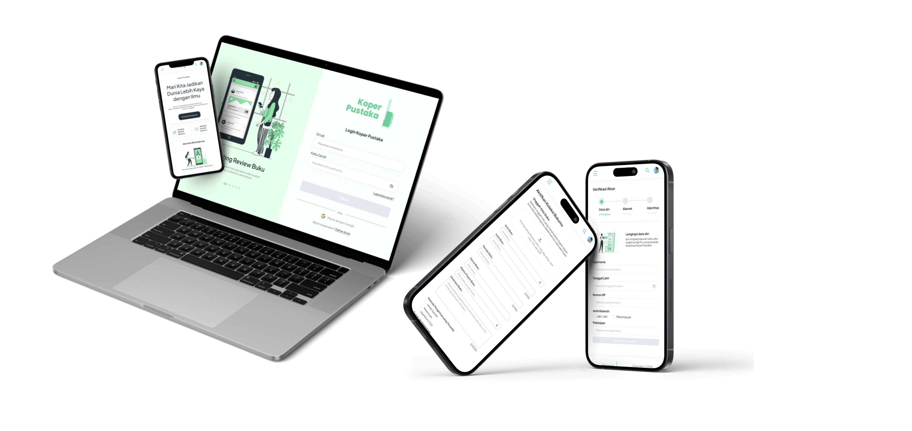
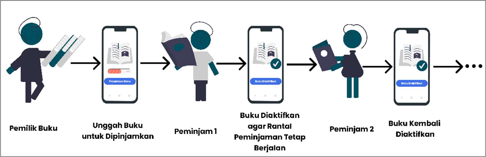
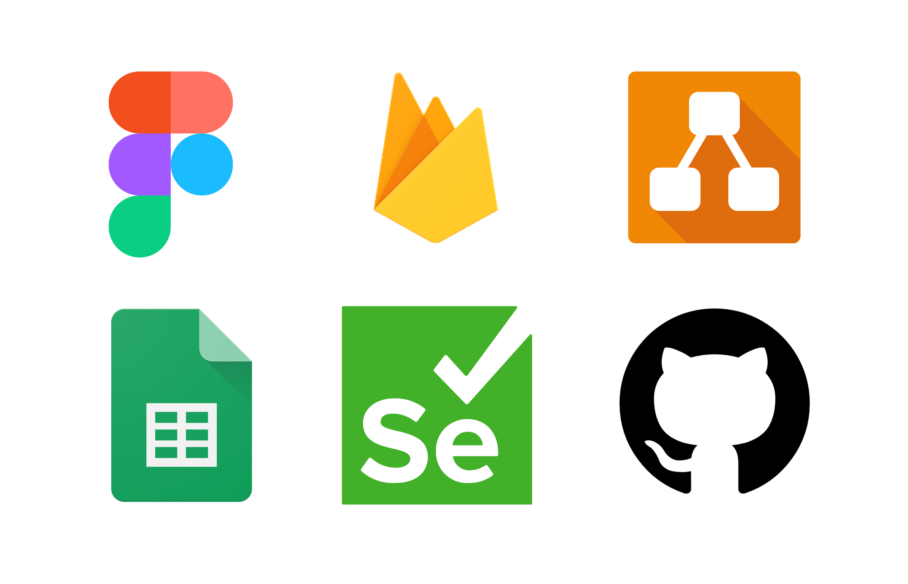
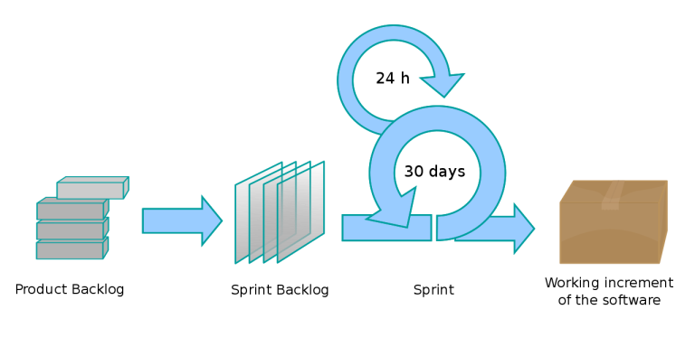
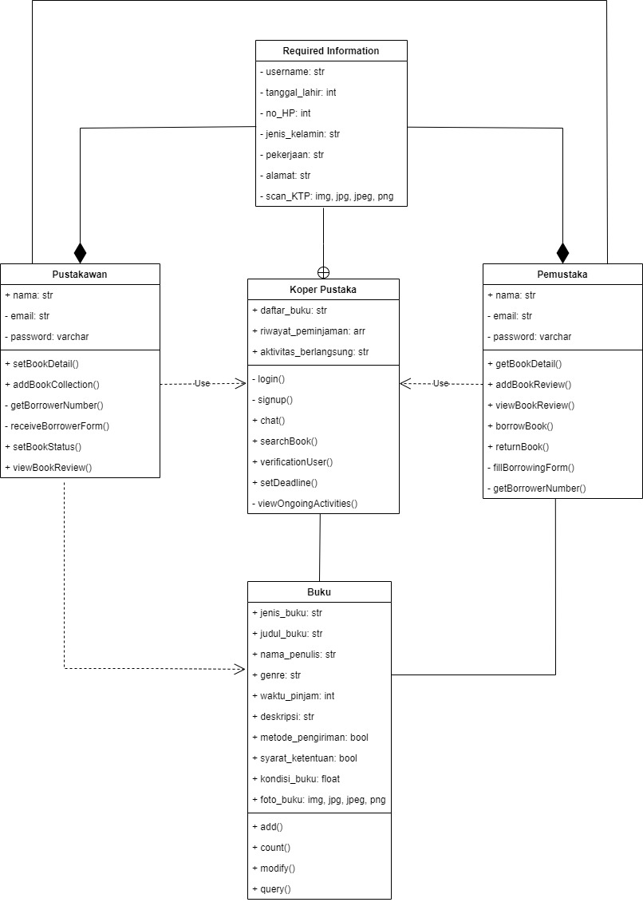
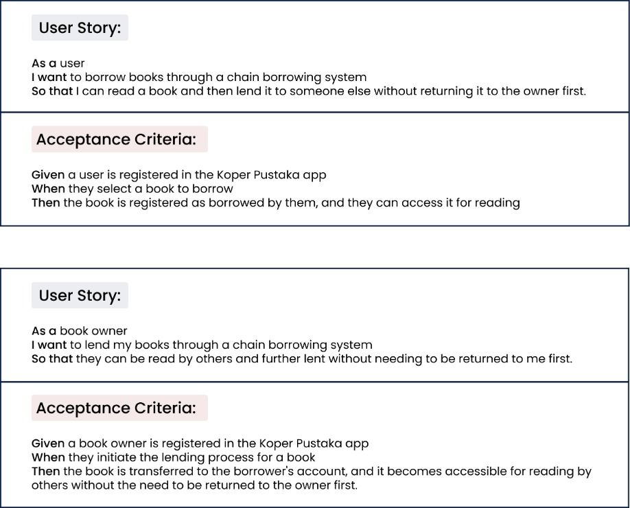
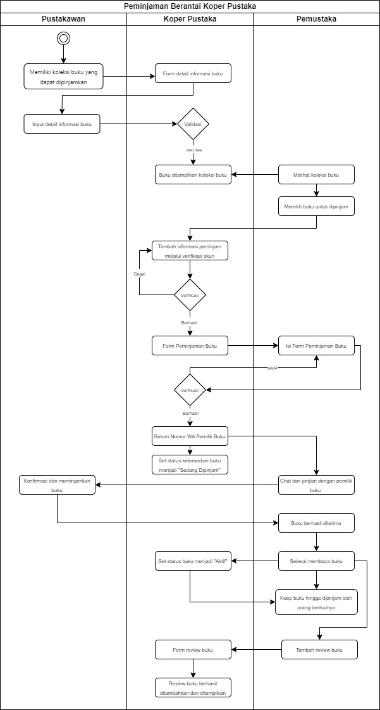

# Koper Pustaka 
Project Capstone K2-02 FAR

[Sekilas Tentang](#sekilas-tentang) | [Software Architecture](#software-architecture) | [Design System](#design-system) | [Cara Pemakaian](#cara-pemakaian) | [Developers](#developers) | [Referensi](#referensi)
:---:|:---:|:---:|:---:|:---:|:---:|

## Sekilas Tentang  
[`^ Back to Top ^`](#koper-pustaka)

### Apa Itu Koper Pustaka?
Koper Pustaka adalah aplikasi perpustakaan berbasis komunitas yang menyediakan layanan peminjaman buku secara luas dan tanpa batasan oleh perpustakaan. (......)

### Tujuan Koper Pustaka
Tujuan Koper Pustaka adalah mempermudah masyarakat Indonesia dalam melakukan pinjam-meminjam buku melalui perpustakaan berbasis komunitas serta meningkatkan literasi masyarakat melalui kegiatan tersebut. (.......)

### Cara Kerja Koper Pustaka

1. Pemilik Buku Mengunggah Buku
Pemilik buku mengunggah informasi tentang buku yang ingin dipinjamkan ke dalam aplikasi, termasuk judul, pengarang, genre, waktu pinjam, dan deskripsi buku.
2. Buku Dipinjam oleh Peminjam 1
Pengguna lain yang tertarik meminjam buku tersebut (Peminjam 1) dapat melihat daftar buku yang tersedia dan meminjam buku yang diinginkan.
3. Buku Diaktifkan Kembali oleh Peminjam 1 Setelah Selesai Dipinjam
Setelah selesai membaca, Peminjam 1 mengaktifkan kembali status buku dalam aplikasi, menandakan bahwa buku tersebut siap untuk dipinjam oleh pengguna lain.
4. Buku Dipinjam oleh Peminjam 2
Pengguna lain (Peminjam 2) dapat melihat buku yang telah diaktifkan kembali dan meminjamnya.
5. Buku Kembali Diaktifkan
Setelah selesai membaca, Peminjam 2 mengulangi proses pengaktifan buku dalam aplikasi, sehingga buku tersebut bisa dipinjam oleh pengguna lain berikutnya.
6. Buku Kembali ke Pemilik
Hal ini terjadi jika buku tidak lagi dipinjam oleh pengguna lain, maka pemilik asli buku dapat mengambil kembali bukunya dan menunggu peminjam selanjutnya.

### Programming Language

- **JavaScript (React.js)** -> Kerangka kerja JavaScript yang digunakan untuk pengembangan antarmuka pengguna aplikasi serta mengelola logika aplikasi dan alur data.
- **HTML** -> Membuat struktur dan konten dari halaman web aplikasi koper pustaka
- **CSS** -> Mendesain tampilan dan tata letak halaman web aplikasi koper pustaka

### Tools
 
- Figma ->  untuk merancang dan mendesain ulang antarmuka pengguna (UI) dan pengalaman pengguna (UX) aplikasi.
- Firebase -> untuk autentikasi, basis data real-time, penyimpanan, dan hosting aplikasi.
- Draw.io -> untuk membuat use case, class diagram, dan perencanaan sistem lainnya.
- Google Spreadsheet -> untuk pencatatan hasil test case.
- Selenium -> untuk pengujian otomatis aplikasi web untuk memastikan kualitas dan fungsionalitas aplikasi.
- Git dan Github -> untuk mengelola kode sumber aplikasi Koper Pustaka.

### Software Development Terminology  
Software Development Terminology yang digunakan pada aplikasi Koper Pustaka adalah Scrum, yang merupakan kerangka kerja pengembangan perangkat lunak iteratif dan inkremental untuk mengelola proyek secara efisien.

Dokumentasi:

---
## Software Architecture
[`^ Back to Top ^`](#koper-pustaka)

### Use Case Diagram

### Class Diagram

### User Story

### Swimlane Diagram

---

## Design System
[`^ Back to Top ^`](#koper-pustaka)

figma components, colors dll

---

## QA Test Result

## Cara Pemakaian
[`^ Back to Top ^`](#koper-pustaka)

cara pakai koper pustaka dari 2 pov:
sebagai pemilik buku
sebagai peminjam buku
cara jalanin klo clone

---

## Developers
[`^ Back to Top ^`](#koper-pustaka)

anggotanya siapa aja

---

## Referensi
[`^ Back to Top ^`](#koper-pustaka)

skripsi ka lessy n najema

minus: QA test 